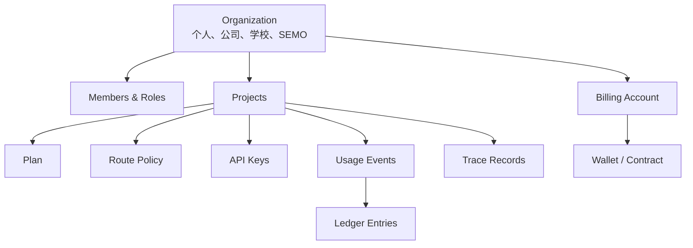
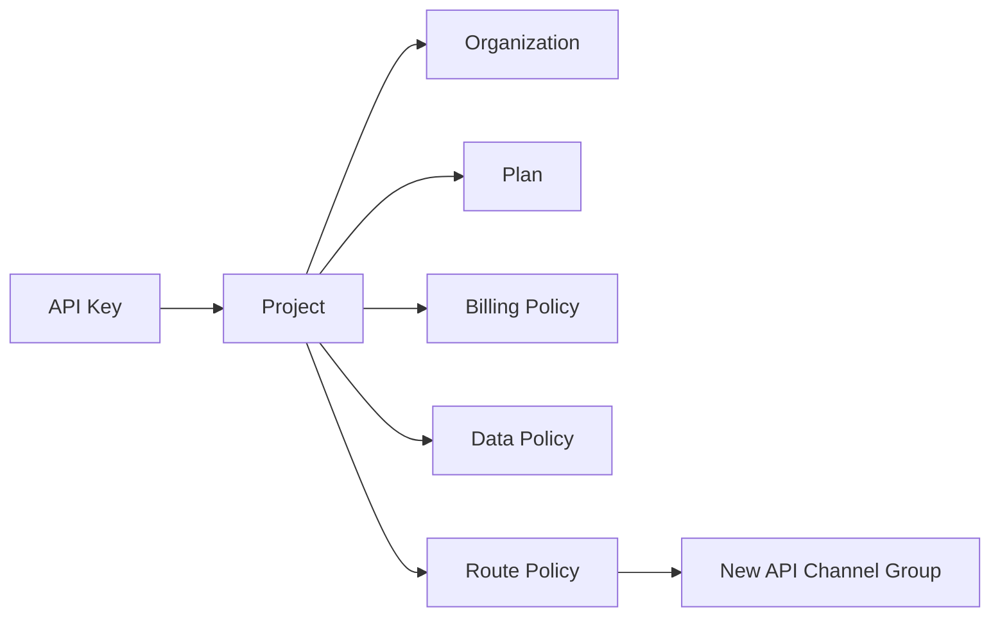
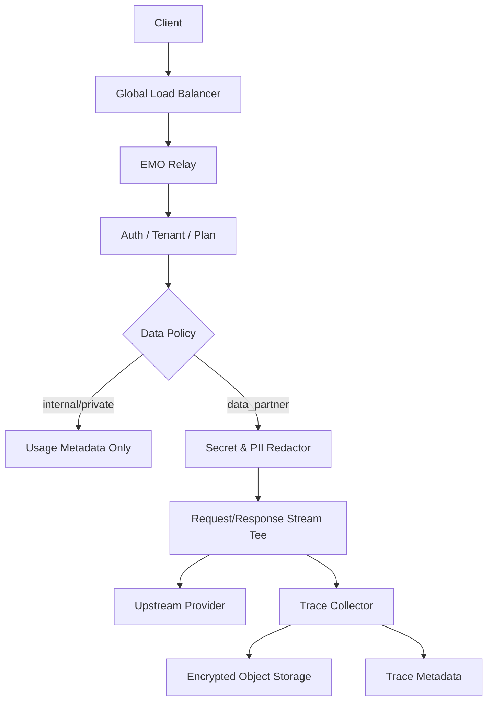
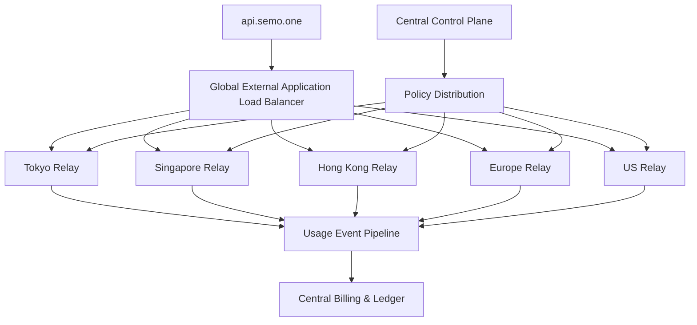

# EMO API 平台架构

- 状态：Target Architecture
- 文档版本：1.0
- 更新日期：2026-07-31
- 适用系统：`api.semo.one`
- 当前部署区域：GCP `asia-northeast1`（东京）

## 1. 目标

EMO API 是一个面向个人、企业、学校和 SEMO 内部团队的多租户 AI API 平台。平台在统一 API 协议之上提供：

- Organization、成员和角色管理；
- Project、API Key、模型权限和预算管理；
- 多种隐私与数据合作套餐；
- 上游模型路由、故障转移和多区域接入；
- 预付费、合同计费、真实成本和毛利核算；
- 可选的请求/响应轨迹采集、脱敏、加密、保留和删除；
- 企业、学校和内部团队的独立管理与审计。

New API 作为底层模型转发和协议适配引擎。EMO API 在其上增加多租户、策略、计费、轨迹和企业管理能力。

## 2. 核心设计原则

1. **SEMO 也是租户**  
   SEMO 使用与外部客户相同的 Organization、Project、API Key、预算和审计流程，仅通过 `organization_type=internal` 和内部套餐表达差异。

2. **租户、套餐和路由相互独立**  
   Organization 表示归属，Plan 表示商业和数据策略，Route Policy 表示上游路由。三者不能继续共用 New API 的 `Group` 字段。

3. **策略由服务端解析**  
   最终套餐、计价、数据采集和渠道选择由 API Key 对应的 Project 决定，客户端不能通过请求参数切换到其他套餐或低价渠道。

4. **真实成本与客户扣款分离**  
   所有请求均记录上游真实成本。即使 SEMO 内部调用不扣款，也必须进入成本账本。

5. **正文数据与运行日志分离**  
   普通日志不得包含 prompt、response、Authorization、Cookie 或完整 API Key。允许采集的正文进入独立轨迹存储。

6. **从单区域平滑演进到多区域**  
   控制面集中管理，数据面可按区域扩展；新增香港、新加坡、欧美节点时不改变业务模型。

## 3. 领域模型



### 3.1 Organization

Organization 是平台的一级租户和数据隔离边界。

支持的类型：

| 类型 | 说明 |
|---|---|
| `personal` | 个人用户自动创建的个人组织 |
| `company` | 企业客户 |
| `school` | 学校、实验室、培训机构 |
| `internal` | SEMO 内部组织 |

Organization 负责：

- 成员和角色；
- 统一账单账户；
- 合同和组织级价格覆盖；
- 数据驻留区域；
- 项目列表；
- 组织级审计；
- 组织状态和风控。

### 3.2 SEMO Organization

SEMO 本身创建为普通内部组织：

```text
Organization: SEMO
type: internal
slug: semo
├── Project: EMO Web Production
├── Project: Internal Development
├── Project: QA / Load Testing
└── Project: Operations
```

推荐配置：

```json
{
  "organization_type": "internal",
  "billing_mode": "internal_cost",
  "customer_charge_enabled": false,
  "default_plan": "internal",
  "data_capture": false
}
```

SEMO 调用的 `charged_amount` 为 0，但 `upstream_cost` 必须正常记录。内部用户不需要购买套餐，但仍受 RPM、TPM、模型权限、项目预算和组织预算约束。

Organization Role 与 Platform Role 必须分离：

- Organization Role 只能管理本组织资源；
- Platform Role 可以管理整个平台；
- 属于 SEMO Organization 不自动获得平台管理员权限。

### 3.3 Project

Project 是 API Key、套餐、预算、路由和数据策略的主要承载单位。

典型用途：

- 企业的部门、产品或环境；
- 学校的课程、实验室或研究项目；
- 个人用户的不同应用；
- SEMO 的生产、开发和压测环境。

一个 Project 包含：

- 所属 Organization；
- Billing Account；
- Plan；
- Route Policy；
- 模型白名单；
- API Keys；
- 项目预算；
- 数据驻留和保留策略；
- 项目成员与权限。

### 3.4 成员与角色

组织角色：

| 角色 | 权限 |
|---|---|
| `owner` | 组织所有配置和成员管理 |
| `billing_admin` | 余额、合同、账单、发票和预算 |
| `project_admin` | 项目、Key、模型和成员管理 |
| `developer` | 使用项目、创建受限 Key、查看自身用量 |
| `viewer` | 只读查看被授权的项目和用量 |

平台角色：

| 角色 | 权限 |
|---|---|
| `platform_root` | 平台最高权限，仅紧急使用 |
| `platform_operator` | 渠道、用户、组织、风控和运行管理 |
| `platform_billing` | 价格、合同和财务数据 |
| `platform_auditor` | 只读审计 |

## 4. 套餐与数据策略

### 4.1 套餐定义

| 套餐代码 | 产品名称 | 正文策略 | 初始计价 |
|---|---|---|---:|
| `internal` | SEMO Internal | 不持久化正文 | 客户扣款 0，记录真实成本 |
| `private` | Privacy | 不持久化正文 | 上游实际成本 × 1.30 |
| `data_partner` | Data Partner | 脱敏后加密保存轨迹 | 上游实际成本 × 1.20 |

倍率是可版本化的价格规则，不应写死在业务代码中。如果商业定义改为其他折扣或毛利目标，只更新 Pricing Rule。

### 4.2 Internal

- 仅允许 `organization_type=internal` 使用；
- 不需要充值或购买套餐；
- 每个成员、应用和环境使用独立 API Key；
- 客户扣款为 0；
- 记录模型、token、缓存 token、thinking token 和真实成本；
- 设置成员、Key、Project 和 Organization 四级预算；
- 预算超限可以告警或阻断，由 Project 策略决定；
- 默认不保存请求和响应正文。

### 4.3 Privacy

- EMO 不持久化 prompt、response 和文件正文；
- 保存计费和运行所需的元数据；
- 使用 Privacy Route Policy；
- 向上游发送适用的非持久化参数；
- 管理页面明确展示上游服务商的数据处理边界；
- 普通错误日志不得附带完整上游响应正文。

允许保存的典型元数据：

```text
request_id
organization_id
project_id
user_id
api_key_id
provider
model
token usage
upstream cost
charged amount
latency
status code
route decision
timestamps
```

### 4.4 Data Partner

- 网络传输仍然使用 TLS；
- 根据 Project 数据协议采集请求和响应正文；
- 采集前移除认证信息并执行 Secret/PII 脱敏；
- 正文加密保存到独立对象存储；
- 数据用途、同意版本、保留期和驻留区域均可审计；
- 客户可以查看、导出和删除本组织的数据；
- 默认原始轨迹保留 30 天；
- 脱敏数据保留期由合同或 Project Policy 决定；
- 撤回数据合作后，新请求立即停止采集，历史数据按策略删除。

## 5. 企业与学校

### 5.1 企业

```text
Organization: ACME
├── Billing Account: ACME Contract
├── Project: Production
│   ├── Plan: private
│   ├── Monthly Budget: $10,000
│   └── API Keys: backend-prod, batch-prod
└── Project: Evaluation
    ├── Plan: data_partner
    ├── Monthly Budget: $1,000
    └── API Keys: eval-team-a, eval-team-b
```

企业可以获得：

- 组织统一余额或后付费合同；
- 项目、部门和环境隔离；
- 组织级或项目级合同价；
- 成员角色和 SSO/OIDC；
- 独立模型白名单；
- API Key 轮换和 IP 限制；
- 成本中心和用量导出；
- 区域数据驻留；
- 组织审计日志。

### 5.2 学校

```text
Organization: Tokyo University
├── Project: AI Course 2026
│   ├── Plan: data_partner
│   ├── Shared Budget: $2,000
│   ├── 100 Student Keys
│   └── Course End: 2027-03-31
└── Project: Research Lab
    ├── Plan: private
    ├── Shared Budget: $5,000
    └── 10 Researcher Keys
```

学校专用能力：

- 批量生成和导入学生 API Key；
- 每名学生独立额度；
- 课程共享总预算；
- 课程结束批量失效；
- 按课程、班级、成员和 Key 汇总；
- 教师、助教、学生的分级权限；
- 研究项目和教学项目使用不同套餐；
- 轨迹正文的查看权限独立控制。

## 6. API Key

API Key 属于 Project，不直接属于个人。成员退出组织后，Key 和使用数据仍归 Organization 所有。

API Key 支持：

- 名称和用途；
- 状态与过期时间；
- Key 级余额或无限额度；
- RPM、TPM、日预算和月预算；
- 模型白名单；
- IP/CIDR 白名单；
- 环境标签；
- 创建人和最后使用时间；
- 并行轮换；
- 立即吊销；
- 完整审计。

### 6.1 Key 存储

正式版不在数据库保存可恢复的完整 API Key：

- 创建时只显示一次原始 Key；
- 保存 `key_prefix`、`key_digest` 和 `last_four`；
- 使用服务端 HMAC-SHA256 生成确定性摘要；
- HMAC Secret 存入 Secret Manager；
- 数据库通过摘要查询；
- 管理员不能查看完整 Key；
- Key 轮换期间允许新旧 Key 短期共存。

## 7. 策略解析



每次请求按以下顺序解析：

1. 校验 API Key；
2. 获取 Organization 和 Project；
3. 校验组织、项目和 Key 状态；
4. 解析模型权限和限流；
5. 解析 Plan 和 Data Policy；
6. 解析 Pricing Rule 和合同覆盖；
7. 解析 Route Policy；
8. 预估并预占额度；
9. 调用上游；
10. 根据真实 usage 结算；
11. 写入 Usage Event 和 Ledger；
12. 如果 Data Policy 允许，完成轨迹存储。

解析结果写入请求上下文，后续组件不得重新信任客户端提供的 Group 或套餐字段。

## 8. New API Group 的定位

现有 New API `Group` 只作为内部渠道路由池：

```text
openai-private
openai-standard
anthropic-private
anthropic-standard
vertex-tokyo
vertex-singapore
```

它不再表示：

- 用户套餐；
- Organization；
- 公司或学校；
- 账单归属；
- 数据采集同意。

Route Policy 将 Project 映射到一个或多个 Channel Group。用户不能通过请求参数选择未授权的 Group。

## 9. 计费与账本

### 9.1 金额模型

每次请求至少记录：

```text
upstream_cost
list_price
contract_adjustment
discount
charged_amount
currency
pricing_rule_id
pricing_rule_version
```

其中：

- `upstream_cost`：根据上游真实 token 类型和价格计算；
- `list_price`：EMO 标准售价；
- `contract_adjustment`：企业合同覆盖；
- `discount`：活动、数据合作或其他折扣；
- `charged_amount`：最终扣款；
- `pricing_rule_version`：保证历史账单可重算。

必须区分：

- 普通 input token；
- cached input/read token；
- cache creation/write token；
- output token；
- thinking/reasoning token；
- 音频、图片、视频和工具调用费用；
- 上游固定请求费用。

### 9.2 账本

Ledger 使用不可变追加记录，不直接覆盖历史余额：

| 类型 | 说明 |
|---|---|
| `topup` | 充值 |
| `grant` | 赠送额度 |
| `reserve` | 请求预占 |
| `settle` | 按真实 usage 结算 |
| `release` | 释放未使用预占 |
| `refund` | 退款 |
| `adjustment` | 人工对账调整 |
| `invoice` | 后付费账单 |

余额是 Ledger 的投影结果。所有人工调整必须带操作人、原因和审计记录。

### 9.3 合同覆盖

价格覆盖优先级：

```text
Project Contract Override
    > Organization Contract Override
    > Plan Pricing Rule
    > Platform Default Pricing Rule
```

合同可以覆盖：

- 模型价格；
- 套餐倍率；
- 月度承诺消费；
- 免费额度；
- 预付费或后付费；
- 信用上限；
- 数据保留期；
- 数据驻留区域；
- SLA。

## 10. 轨迹采集



### 10.1 采集路径

- 在 API Key 鉴权完成后解析 Data Policy；
- `internal` 和 `private` 不初始化正文采集器；
- `data_partner` 初始化采集器；
- 请求体和流式响应以 tee 方式传递；
- 客户响应不等待离线分析任务完成；
- 采集失败记录指标和告警，不改变已完成的上游计费事实；
- 为单条轨迹设置正文大小上限。

### 10.2 脱敏

采集前移除或识别：

- `Authorization`；
- `x-api-key`；
- Cookie 和 Session；
- OpenAI、Anthropic、GCP、AWS 等常见密钥格式；
- 私钥和证书；
- 数据库连接串；
- 密码和 Token 字段；
- Project 配置的自定义敏感模式；
- 可配置的个人信息字段。

原始敏感 Header 不得进入日志、Trace Metadata 或 Trace Object。

### 10.3 存储

- Trace Metadata 存入业务数据库；
- Request/Response 正文存入独立 GCS Bucket；
- 正文压缩后执行信封加密；
- Key Encryption Key 使用 Cloud KMS；
- Object Path 包含 region、organization、project、date 和 request ID；
- Bucket Lifecycle 执行自动删除；
- 不允许通过普通 Usage Log 接口返回正文；
- 轨迹读取、导出和删除全部进入 Audit Log。

建议对象路径：

```text
gs://emo-traces-{region}/
  organizations/{organization_id}/
  projects/{project_id}/
  yyyy/mm/dd/{request_id}/
    request.json.zst.enc
    response.jsonl.zst.enc
```

### 10.4 同意与用途

Consent Record 保存：

- Organization 和 Project；
- 套餐；
- 同意主体；
- 条款版本；
- 数据用途；
- 同意时间；
- 撤回时间；
- 原始和脱敏数据保留期；
- 数据驻留区域。

Project 的 Data Policy 必须引用有效的 Consent Record 或企业合同。

## 11. 多区域架构



### 11.1 控制面

控制面负责：

- Organization、成员和角色；
- Project 和 API Key；
- Plan、Pricing、Data 和 Route Policy；
- Billing Account、合同和账本；
- 后台管理和审计；
- 配置版本和策略分发。

控制面主数据库部署在东京 Cloud SQL HA。策略变更通过版本化事件分发到各区域缓存。

### 11.2 数据面

数据面负责：

- API Key 鉴权；
- 限流和预算预检；
- 策略执行；
- 上游模型调用；
- 流式响应；
- Usage Event 上报；
- 按策略采集轨迹。

各区域数据面：

- 使用区域本地策略缓存；
- 直接连接就近或指定上游；
- 异步上报 Usage Event；
- 轨迹写入指定数据驻留区域；
- 控制面短暂不可用时可在有限时间内继续使用已缓存策略。

### 11.3 数据驻留

Organization 或 Project 可以配置：

```text
japan
singapore
eu
us
```

数据驻留约束：

- Trace Object 不离开指定区域；
- Trace Metadata 中的敏感字段遵循相同区域策略；
- Usage 和账单元数据可以进入中央账本；
- 路由策略不得把受限制正文发送到不允许的处理区域。

## 12. 安全

### 12.1 网络与基础设施

- 所有公网访问通过 HTTPS；
- Global Load Balancer 作为唯一公网入口；
- Cloud Run ingress 限制为 Load Balancer；
- Cloud Armor 提供 WAF、速率限制和封禁策略；
- Cloud SQL 使用私网连接；
- Redis/Memorystore 使用 VPC；
- Secret 存入 Secret Manager；
- KMS 管理轨迹加密密钥；
- 管理后台与 Relay 使用独立 Service Account；
- 最小权限 IAM；
- Production 与非 Production 使用独立资源。

### 12.2 应用安全

- Root 账户不用于日常管理；
- 平台管理员强制 MFA/Passkey；
- API Key 只显示一次；
- 所有权限变更进入 Audit Log；
- 禁止在 Debug 日志输出请求和响应正文；
- 对管理操作、Key 创建和导出做二次认证；
- 企业成员和平台管理员的权限体系完全分离；
- 禁止通过客户端字段覆盖 Organization、Project、Plan 或 Route Policy。

### 12.3 风控

- Key、用户、Project、Organization 四级限流；
- 异常地域、模型、流量和消费检测；
- 每日和每月消费上限；
- 上游账户硬预算；
- Key 泄露一键吊销；
- 异常请求自动熔断；
- 渠道余额和健康状态监控；
- 收入与上游真实成本每日对账。

## 13. 管理后台

### 13.1 平台后台

- Organization 和成员；
- Plan、价格和合同；
- Project、API Key 和模型权限；
- 上游渠道、余额和健康状态；
- 用量、收入、成本和毛利；
- 轨迹采集状态和访问审计；
- 风控事件；
- 区域和数据驻留；
- 账本调整和退款；
- 系统配置和发布版本。

### 13.2 客户后台

- Organization 和成员；
- Project；
- API Key 创建、轮换和吊销；
- 余额、账单、合同和发票；
- 模型和路由状态；
- 用量、预算和告警；
- 套餐和数据策略；
- Data Partner 轨迹查看、导出和删除；
- Organization Audit Log。

## 14. 数据模型

目标表：

```text
organizations
organization_members
platform_roles
billing_accounts
projects
project_members
api_keys
plans
contracts
pricing_rules
route_policies
data_policies
wallets
ledger_entries
usage_events
trace_records
trace_objects
consent_records
audit_logs
policy_versions
```

关键关系：

```text
organization_members.organization_id
projects.organization_id
projects.billing_account_id
projects.plan_id
projects.route_policy_id
projects.data_policy_id
project_members.project_id
api_keys.project_id
usage_events.organization_id
usage_events.project_id
usage_events.api_key_id
ledger_entries.usage_event_id
trace_records.usage_event_id
trace_objects.trace_record_id
consent_records.project_id
```

所有业务表使用不可变 ID。Organization slug、Project slug 和 API Key name 可以修改，不作为外键。

## 15. 从当前系统迁移

### 15.1 数据迁移

1. 创建 SEMO Internal Organization；
2. 为现有普通用户创建 Personal Organization；
3. 为每个 Organization 创建 Default Project；
4. 将现有用户余额迁移到 Billing Account；
5. 将现有 Token 迁移为 Project API Key；
6. 将现有 Group 映射为 Route Policy；
7. 将现有倍率迁移为版本化 Pricing Rule；
8. 保留旧字段用于兼容读取；
9. 双写验证完成后停止使用旧业务含义；
10. 最后移除旧 Group 对套餐和租户的职责。

### 15.2 兼容策略

- 现有 `/v1/*` 接口保持兼容；
- 现有 API Key 在迁移窗口内继续可用；
- API Key 后台解析到 Default Project；
- 客户端无需提交 Organization 或 Project Header；
- 新旧计费并行核对，确认一致后切换；
- 迁移期间禁止通过客户端选择未授权 Group。

## 16. 实施模块

1. **Organization 与 Project**
   - 组织、成员、角色、Project 和迁移。

2. **API Key 安全**
   - Project Key、摘要存储、轮换、权限和审计。

3. **Policy Engine**
   - Plan、Pricing、Data、Route Policy 和服务端解析。

4. **Billing Ledger**
   - 真实成本、预占、结算、退款、合同覆盖和毛利。

5. **Trace Pipeline**
   - 流式采集、脱敏、加密、保留、查看和删除。

6. **Enterprise Portal**
   - 企业、学校、成员、项目、批量 Key 和报表。

7. **Regional Data Plane**
   - 多区域 Relay、策略缓存、事件回传和数据驻留。

8. **Operations**
   - 监控、告警、备份、恢复、风控和成本对账。

## 17. 上线验收

### 17.1 多租户

- [ ] SEMO、个人、企业和学校均通过 Organization 使用平台；
- [ ] Organization 之间无法读取成员、Key、用量、账单或轨迹；
- [ ] Platform Role 与 Organization Role 完全分离；
- [ ] 企业可以建立多个不同套餐的 Project；
- [ ] 学校可以批量生成、限制和失效学生 Key。

### 17.2 套餐

- [ ] Internal 不扣客户余额但记录真实成本；
- [ ] Privacy 不产生任何正文对象；
- [ ] Data Partner 正确生成脱敏加密轨迹；
- [ ] 用户无法通过请求参数切换套餐或渠道组；
- [ ] 套餐、合同和价格版本可以追溯。

### 17.3 计费

- [ ] 普通、缓存、cache creation、thinking 等 token 分项正确；
- [ ] 预占、结算、释放和退款账本平衡；
- [ ] 每个请求可以追溯上游成本和客户扣款；
- [ ] SEMO 内部项目可以查看真实成本；
- [ ] 收入和上游账单差异具备自动告警。

### 17.4 轨迹

- [ ] Authorization、API Key、Cookie 和私钥不会进入轨迹；
- [ ] Privacy/Internal 路径不初始化正文采集器；
- [ ] Data Partner 流式响应采集不影响客户端流式输出；
- [ ] 自动保留期和删除任务有效；
- [ ] 查看、导出和删除均有审计记录；
- [ ] 数据驻留区域符合 Project Policy。

### 17.5 安全与运行

- [ ] API Key 数据库只保存摘要；
- [ ] 平台管理员强制 MFA/Passkey；
- [ ] Cloud SQL 私网、备份和 PITR 已验证；
- [ ] Cloud Armor、限流和预算硬上限有效；
- [ ] Secret Manager 和 KMS 权限符合最小权限；
- [ ] 完成一次数据库恢复和区域故障演练；
- [ ] 生产日志未包含请求/响应正文。

## 18. 架构决策摘要

| 决策 | 结果 |
|---|---|
| SEMO 是否作为普通组织 | 是，类型为 `internal` |
| 企业和学校如何隔离 | First-class Organization |
| 部门、课程和应用如何隔离 | Project |
| 套餐放在哪里 | Project 默认套餐，可由合同覆盖 |
| New API Group 的用途 | 仅内部渠道路由 |
| API Key 属于谁 | Project |
| 正文存在哪里 | 独立加密对象存储 |
| 运行日志是否保存正文 | 否 |
| 真实成本是否对内部调用计算 | 是 |
| 多区域如何扩展 | 集中控制面 + 区域数据面 |

